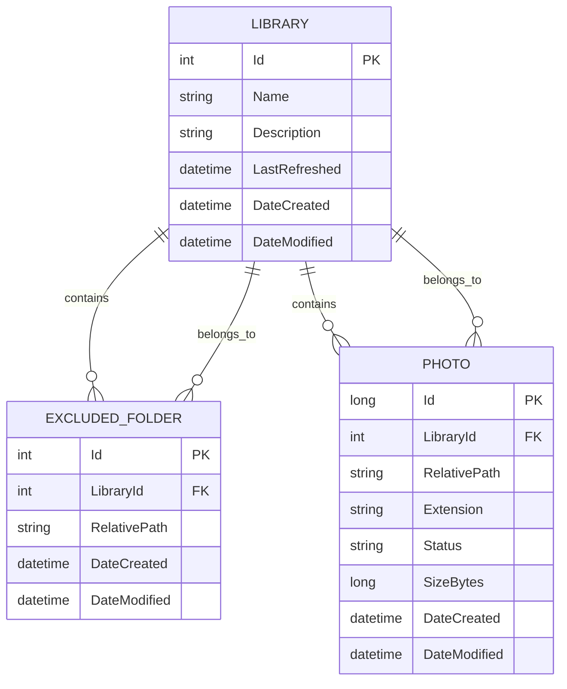
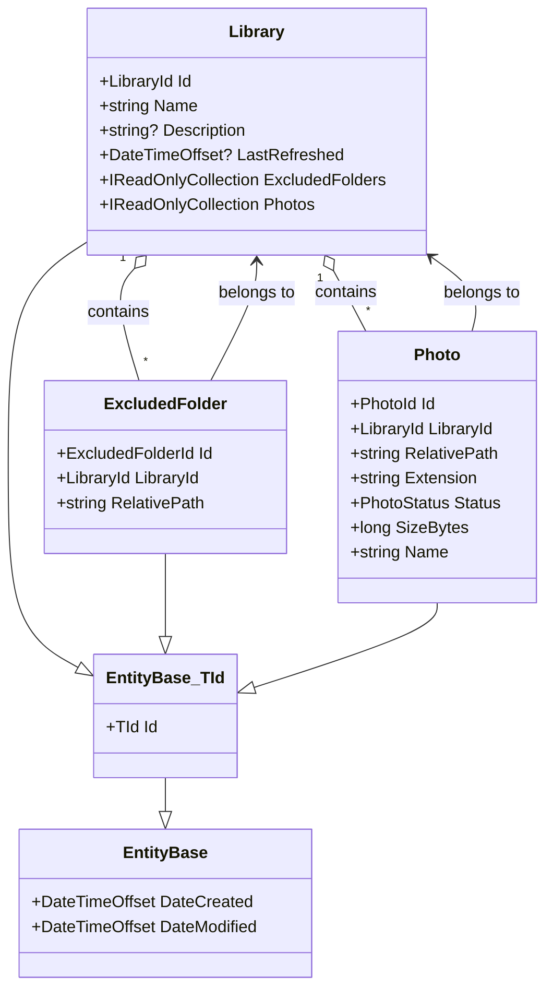

# Design

## ERD 

```mermaid
erDiagram
    LIBRARY {
        int Id PK
        string Name
        string Description
        datetime LastRefreshed
        datetime DateCreated
        datetime DateModified
    }

    EXCLUDED_FOLDER {
        int Id PK
        int LibraryId FK
        string RelativePath
        datetime DateCreated
        datetime DateModified
    }

    PHOTO {
        long Id PK
        int LibraryId FK
        string RelativePath
        string Extension
        string Status
        long SizeBytes
        datetime DateCreated
        datetime DateModified
    }

    LIBRARY ||--o{ EXCLUDED_FOLDER : contains
    LIBRARY ||--o{ PHOTO : contains
    EXCLUDED_FOLDER }o--|| LIBRARY : belongs_to
    PHOTO }o--|| LIBRARY : belongs_to
```

## Class Diagram

```mermaid
classDiagram
    class EntityBase {
        +DateTimeOffset DateCreated
        +DateTimeOffset DateModified
    }
    class EntityBase_TId {
        +TId Id
    }
    EntityBase_TId --|> EntityBase

    class Library {
        +LibraryId Id
        +string Name
        +string? Description
        +DateTimeOffset? LastRefreshed
        +IReadOnlyCollection<ExcludedFolder> ExcludedFolders
        +IReadOnlyCollection<Photo> Photos
    }

    class ExcludedFolder {
        +ExcludedFolderId Id
        +LibraryId LibraryId
        +string RelativePath
    }

    class Photo {
        +PhotoId Id
        +LibraryId LibraryId
        +string RelativePath
        +string Extension
        +PhotoStatus Status
        +long SizeBytes
        +string Name
    }

    Library --|> EntityBase_TId
    ExcludedFolder --|> EntityBase_TId
    Photo --|> EntityBase_TId

    Library "1" o-- "*" ExcludedFolder : contains
    Library "1" o-- "*" Photo : contains
    ExcludedFolder --> Library : belongs to
    Photo --> Library : belongs to
```
